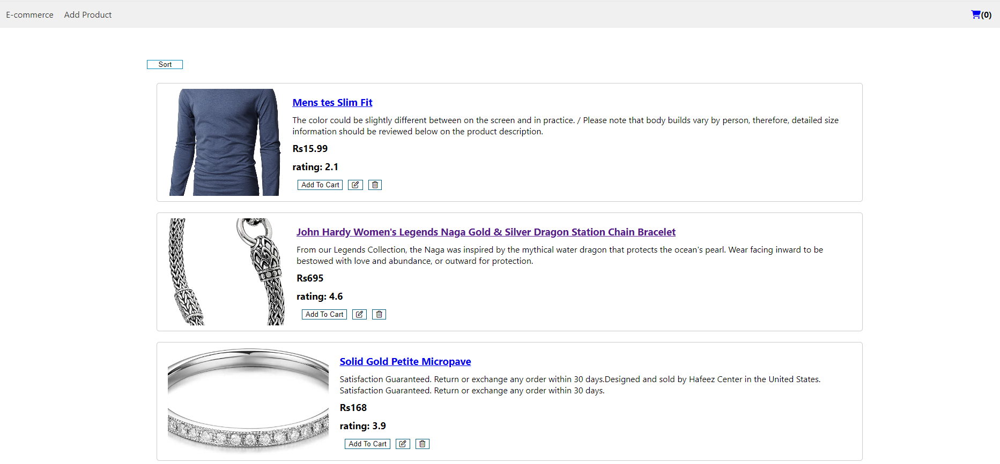
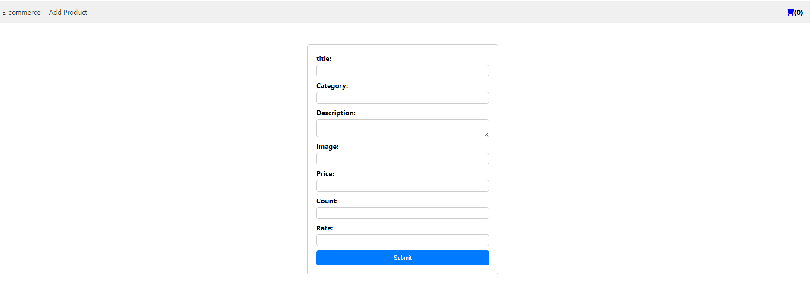
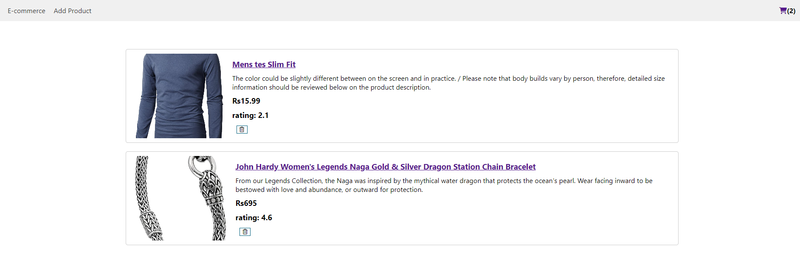

# Ecommerce-Web-Project
Simple Ecommerce React Project to create, read, update and delete products.

## Running the Project
1. Clone the project and navigate to the cloned folder.
2. Use the command npm install to install the dependencies.
3. Start the development server using npm start. the site will be opened at http://localhost:3000.

## Images Screenshots
### Home Page of E-commerce Store

### Adding New Product

### Adding Products to Cart

